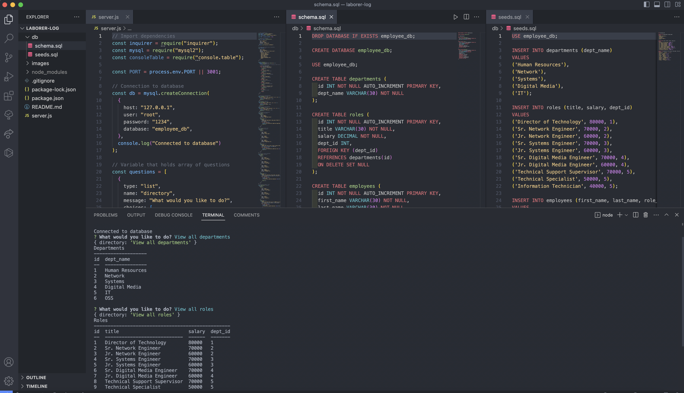

# Laborer Log

## Table of Contents

- [Description](#description)
- [License](#license)
- [Installation](#installation)
- [Usage](#usage)
- [Contributing](#contributing)
- [Tests](#test)
- [Questions](#questions)

## Description

Laborer Log is a command line application that allows the user to view and update information about the departments and employees of a given company. The user can view all departments, roles, and employees, add departments, roles, and employees, and update employee roles.

## Installation

This application requires Node.js, Express.js, and MySQL to run properly in your code editor.

## Usage

This application is meant to be used to store and organize company data.

[Click here to view a demonstration video](https://opensource.org/licenses/MIT)

## License

This project uses MIT

[Click here to view license](https://opensource.org/licenses/MIT)

## Contributing

If you would like to contribute to this project, contact me.

## Tests

N/A

## Questions

- Author: Stevie Miller
- GitHub: [StevieMiller](https://github.com/StevieMiller)
- Email: stephanie.miller@carlsbadschools.net
